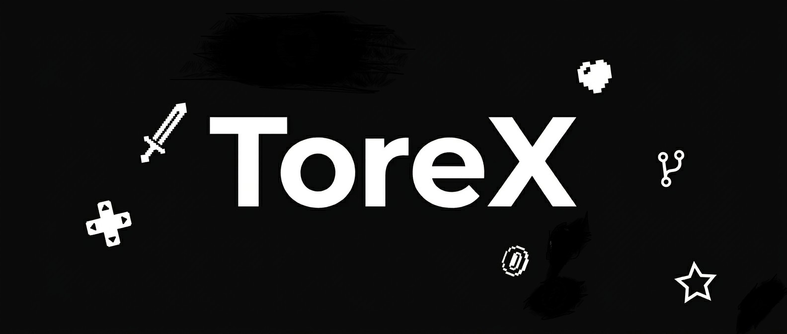

# 👋 Hi there

I'm **ToreX**, a passionate Game Developer. I build my projects using Unity and VS Code-and I absolutely love both of them!

# 🚀 What I Do

* 🎥 Working with Unity
* 🛠️ Constantly learning new systems and logic
* 💡 Crafting games, especially 2D games

# 🛠️ Tech Stack

<picture>
  <source media="(prefers-color-scheme: dark)" srcset="https://raw.githubusercontent.com/thetorex/thetorex/output/github-snake-dark.svg" />
  <source media="(prefers-color-scheme: light)" srcset="https://raw.githubusercontent.com/thetorex/thetorex/output/github-snake.svg" />
  
</picture>
